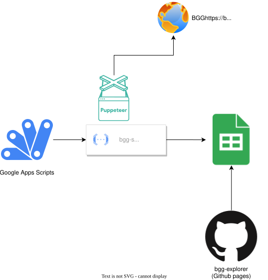

# bgg-explorer

## Architecture



Apps Script starts the daily Cloud Run Job without waiting for the long-running scraper. The job validates the result,
replaces the `data` sheet, and records the successful refresh time in the `metadata` sheet. This application reads the
published `data` range through the Google Sheets API.

## Relatives

This project is related to [bgg-scraping](https://github.com/watabean/bgg-scraping), which focuses on scraping board game ranking data from BoardGameGeek.  
`bgg-explorer` utilizes the scraped data and provides a user-friendly interface for data exploration and visualization.

## Before Installation

Make sure you have Volta installed.
Volta ensures you are using the correct Node.js and npm versions for this project. Follow the instructions on their website to set it up.

## Installation

Install the required dependencies:

```bash
npm install
```

Create a .env file with the following content to configure your Google Sheets API key:

```bash
echo VITE_GOOGLE_SHEETS_API_KEY="your-google-sheets-api-key" > .env
```

Replace your-google-sheets-api-key with your actual API key.
This key is used to fetch data from Google Sheets for this project.

## Run (Local Preview)

Start the development server:

```bash
npm start
```

By default, the application will be available at http://localhost:5173/bgg-explorer/.  
Use this to preview and interact with the project locally.
